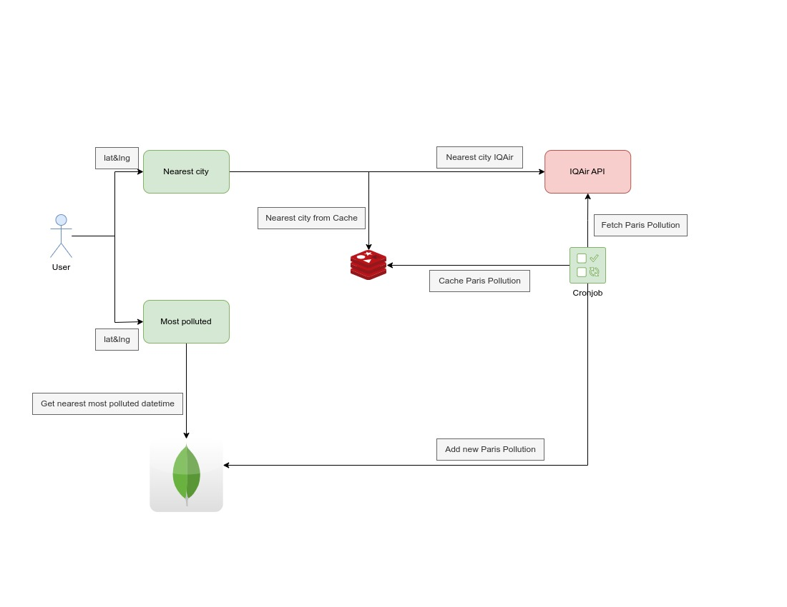

# yassir-assignment

## Installation
```sh
docker compose up -d
```

## Try out
- run this command 
```sh
cp .env.example .env
```
- Register to [IQAir](https://www.iqair.com/fr/dashboard/api) and create API Key 
- In `.env` set the `IQAIR_API_KEY=:your_api_key`
- open your browser on [http://localhost:3000/api-docs/](http://localhost:3000/api-docs/)
- You can then try the endpoint using swagger

## Testing
```sh
npm run test
```

## Service Design


### Service design decisions

> Why MongoDB?
- No need for relations and the schema flexibility 
- MongoDB is feature rich database which can help in geo-spatial queries
- It works easily with js

> Why redis?
- We shouldn't call the 3rd party with every call to the api to reduce the response time and to be scalable
- I used to cache any entry for 1 min while it can be more than that but I sticked to the cronjob requirements
